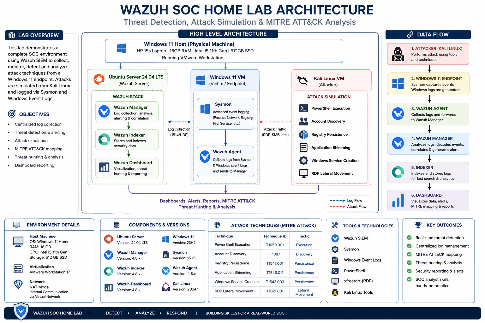

# 🛡️ Wazuh-Based Security Operations Center (SOC) Home Lab

<div align="center">


**A complete Security Operations Center (SOC) Home Lab built using Wazuh SIEM, Windows 11, Ubuntu Server, Kali Linux, Sysmon, and VMware to simulate real-world cyber attacks, investigate security events, perform threat hunting, and map detections to the MITRE ATT&CK Framework.**

</div>

---

# 📌 Project Overview

Modern Security Operations Centers (SOCs) continuously monitor endpoints, detect malicious activities, investigate security events, and respond to cyber threats.

This project demonstrates the design and implementation of a fully functional **SOC Home Lab** using **Wazuh SIEM** and **Microsoft Sysmon** for centralized log collection, endpoint monitoring, threat detection, and incident investigation.

The lab simulates real-world attack techniques from a Kali Linux attacker machine against a monitored Windows endpoint. Security events are collected through the Wazuh Agent, processed by the Wazuh Manager, and analyzed through the Threat Hunting and MITRE ATT&CK dashboards.

This project was built to gain practical Blue Team and SOC Analyst experience through hands-on security monitoring and attack simulation.

---

# 🚀 Project Highlights

✅ Built a complete Wazuh SIEM Home Lab from scratch

✅ Configured Ubuntu Server as the Wazuh Manager, Indexer, and Dashboard

✅ Integrated Windows 11 with Microsoft Sysmon

✅ Configured centralized log collection using the Wazuh Agent

✅ Simulated multiple real-world attack techniques

✅ Performed proactive Threat Hunting

✅ Investigated generated security alerts

✅ Mapped detections to the MITRE ATT&CK Framework

---

# 🎯 Objectives

- Deploy an enterprise-style SIEM environment
- Monitor Windows endpoint activities
- Configure Sysmon for advanced telemetry
- Simulate attacker techniques
- Detect malicious behavior
- Investigate alerts
- Perform Threat Hunting
- Understand SOC workflows
- Gain hands-on Blue Team experience

---

# 🏗️ Lab Architecture

> **Architecture Diagram**



---

# 💻 Lab Environment

| Component | Technology |
|------------|------------|
| SIEM | Wazuh |
| Server | Ubuntu Server 24.04 LTS |
| Endpoint | Windows 11 |
| Endpoint Monitoring | Microsoft Sysmon |
| Log Collection | Wazuh Agent |
| Attacker Machine | Kali Linux |
| Virtualization | VMware Workstation Pro |
| Framework | MITRE ATT&CK |

---

# ⚙️ Technologies Used

- Wazuh SIEM
- Ubuntu Server
- Windows 11
- Microsoft Sysmon
- Kali Linux
- VMware Workstation Pro
- PowerShell
- Windows Event Logs
- MITRE ATT&CK Framework

---

# 🚨 Attack Scenarios

The following attack simulations were successfully executed and detected:

| Attack | MITRE ATT&CK |
|----------|--------------|
| PowerShell Execution | T1059.001 |
| Account Discovery | T1087 |
| Registry Persistence | T1547 |
| Application Shimming | T1546.011 |
| Windows Service Creation | T1543 |
| Remote Desktop (RDP) | T1021.001 |

Each attack generated security events that were successfully detected and investigated through the Wazuh Dashboard.

---

# 🔍 Threat Hunting

The Threat Hunting dashboard was used to investigate:

- PowerShell activity
- Process creation
- Registry modifications
- Windows service creation
- Authentication events
- Account discovery
- Remote Desktop activity
- Sysmon events

---

# 🎯 MITRE ATT&CK Mapping

The simulated attacks were successfully mapped to the following MITRE ATT&CK techniques:

| Technique | ATT&CK ID |
|------------|-----------|
| PowerShell | T1059.001 |
| Account Discovery | T1087 |
| Registry Run Keys | T1547 |
| Application Shimming | T1546.011 |
| Create or Modify System Process | T1543 |
| Remote Services (RDP) | T1021.001 |

---

# 📁 Repository Structure

```
wazuh-soc-home-lab
│
├── README.md
├── LICENSE
│
├── architecture
│   └── architecture.png
│
├── configs
│   ├── ossec.conf
│   └── sysmonconfig.xml
│
├── attack-scenarios
│   └── commands.md
│
├── screenshots
│
└── docs
    └── Wazuh-SOC-Home-Lab-Report.pdf
```

---

# 💡 Skills Demonstrated

- SIEM Deployment
- Wazuh Administration
- Windows Security Monitoring
- Sysmon Configuration
- Threat Hunting
- Endpoint Detection
- Log Analysis
- Incident Investigation
- MITRE ATT&CK Mapping
- Blue Team Operations
- Linux Administration
- VMware Virtualization

---

# 📈 Future Improvements

- Suricata IDS Integration
- Sigma Rule Development
- YARA Malware Detection
- VirusTotal Integration
- Active Directory Monitoring
- SOAR Automation
- Threat Intelligence Feeds
- Email Alerting

---

# 📚 Documentation

A detailed technical report explaining the complete implementation is available in the **docs** directory.

---

# 👨‍💻 Author

## Ajit Nayak

Cybersecurity Enthusiast

SOC Analyst Aspirant

If you found this project helpful or interesting, consider giving it a ⭐ on GitHub.

---

# 📄 License

This project is licensed under the **MIT License**.
