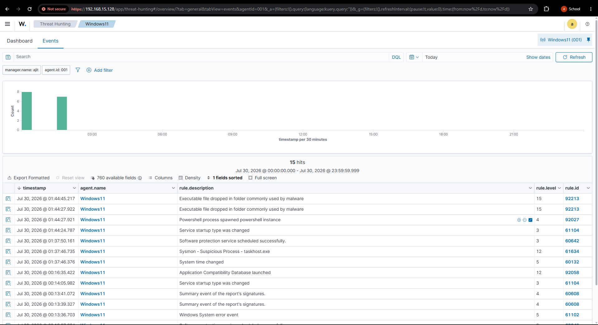
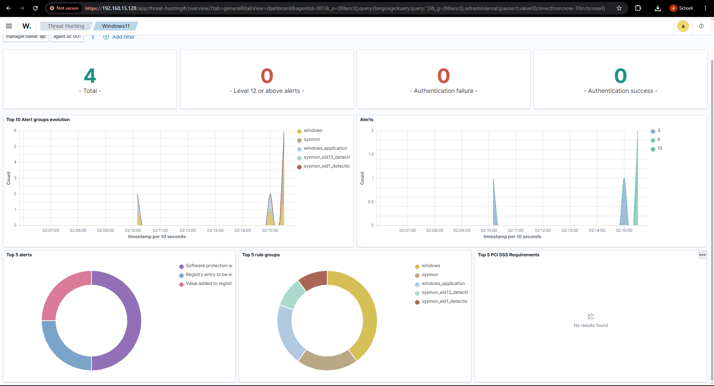
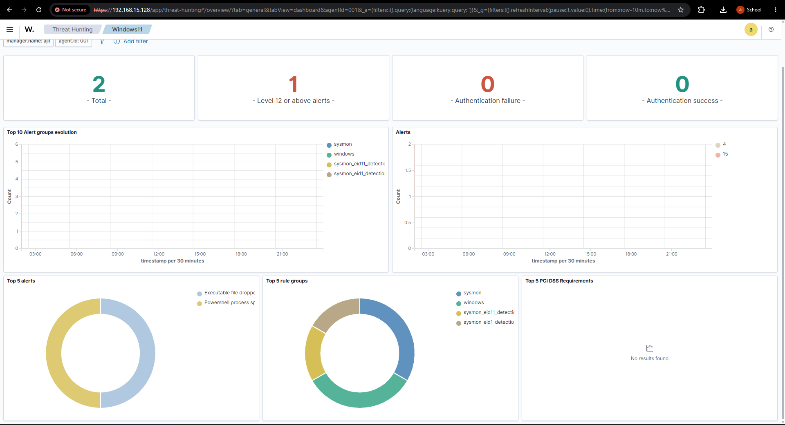
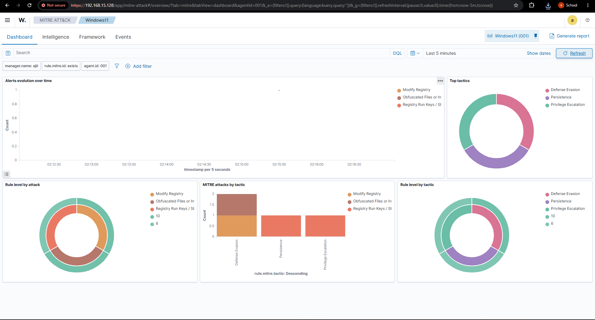
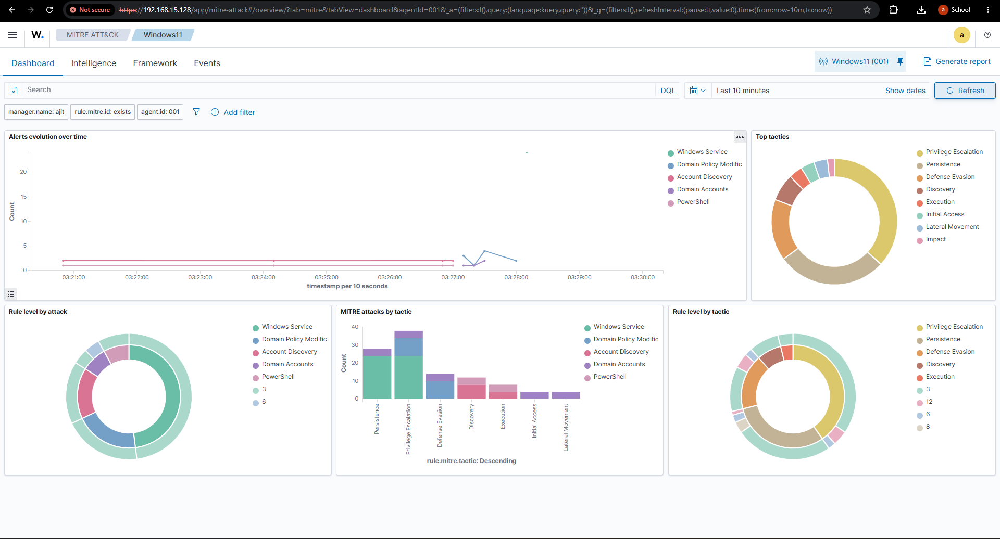

# 🛡️ Enterprise Wazuh SIEM & XDR Threat Detection Home Lab

<div align="center">


**An enterprise-grade Security Operations Center (SOC) Home Lab engineered with Wazuh SIEM & XDR, Microsoft Sysmon, Ubuntu Server, and Kali Linux. Designed to simulate advanced adversary tradecraft (MITRE ATT&CK), build custom XML detection rules and decoders, perform proactive threat hunting, and execute automated SANS-based incident response.**

</div>

---

## 📌 Recruiter Quick-Scan & ATS Profile

| Attribute | Specification |
|---|---|
| **Author** | **Ajit Nayak** — SOC Analyst / Threat Detection Engineer |
| **Target Roles** | **SOC Analyst (L1/L2), Detection Engineer, SIEM Engineer, Incident Responder** |
| **Location & Notice** | **Bangalore, Karnataka, India • Immediate Joiner (0-Day Notice Period)** |
| **Primary Toolchain** | Wazuh SIEM/XDR 4.8+, Microsoft Sysmon v15+, OpenSearch Dashboard, PowerShell, Bash, Python, RegEx |
| **Frameworks Mapped** | MITRE ATT&CK Enterprise Matrix, SANS / NIST SP 800-61 Rev. 2 IR Lifecycle, Cyber Kill Chain |
| **Lab Scale & Scope** | 3 Virtualized Enclaves (Ubuntu Manager, Win11 Target, Kali Attacker), 15+ Custom Rules & Decoders, 7 MITRE Attack Modules |

---

## 📑 Table of Contents
1. [Executive Summary & Threat Model](#-executive-summary--threat-model)
2. [Lab Topology & Ingestion Pipeline](#-lab-topology--ingestion-pipeline)
3. [MITRE ATT&CK Detection Engineering Matrix](#-mitre-attck-detection-engineering-matrix)
4. [Custom Wazuh Rules & Decoders](#-custom-wazuh-rules--decoders)
5. [Adversary Attack Simulation](#-adversary-attack-simulation)
6. [Threat Hunting & Detection Proofs](#-threat-hunting--detection-proofs)
7. [Incident Response & SANS Triage Playbooks](#-incident-response--sans-triage-playbooks)
8. [Sample Telemetry & Alert JSON](#-sample-telemetry--alert-json)
9. [Repository Structure](#-repository-structure)
10. [Setup & Reproduction Guide](#-setup--reproduction-guide)

---

## 🎯 Executive Summary & Threat Model

Modern Security Operations Centers require granular endpoint visibility, high-fidelity threat detection rules, and rapid containment workflows to defend against credential dumping, living-off-the-land binaries (LOLBAS), and automated brute-force attacks.

This project implements an end-to-end Blue Team SOC ecosystem:
- **Centralized SIEM & XDR:** Ubuntu Server hosting Wazuh Manager, Indexer (OpenSearch), and Kibana/Wazuh Dashboard.
- **Deep Endpoint Visibility:** Windows 11 monitored by the Wazuh Agent with granular Sysmon v15 event filtering (Process Creation, Process Access, Registry, Network, DNS).
- **Offensive Adversary Emulation:** Kali Linux adversary executing automated attacks mapped across the MITRE ATT&CK lifecycle.
- **Detection Engineering:** Bespoke Wazuh XML rules and parent-child regex decoders tailored for LSASS memory dumping, obfuscated PowerShell, LOLBAS abuse, and brute-force spikes.
- **Incident Response:** SANS-based operational triage playbooks with automated Wazuh Active Response containment.

---

## 🏗️ Lab Topology & Ingestion Pipeline


### Network Infrastructure

| Node Name | Role | Operating System | IP Address | Primary Services / Components |
|---|---|---|---|---|
| `WAZUH-MGR` | SIEM / XDR Manager & Indexer | Ubuntu Server 24.04 LTS | `192.168.1.10` | Wazuh Manager 4.8, OpenSearch Indexer, Wazuh Dashboard (Port 443/1514) |
| `WIN11-EP01` | Monitored Corporate Endpoint | Windows 11 Pro 64-bit | `192.168.1.100` | Wazuh Agent, Sysmon v15 (`sysmonconfig-export.xml`), EventChannel Ingestion |
| `KALI-ATK` | Adversary Emulation Host | Kali Linux 2024.x | `192.168.1.50` | Bash Simulation Framework, FreeRDP, Hydra, Metasploit, Nmap |

### Ingestion & Correlation Flow

```
   ┌─────────────────────────────────────────────────────────────┐
   │                  OFFENSIVE ADVERSARY                        │
   │  Kali Linux (192.168.1.50) -> Mimikatz / LOLBAS / RDP Attack │
   └──────────────────────────────┬──────────────────────────────┘
                                  │
                                  ▼
   ┌─────────────────────────────────────────────────────────────┐
   │                  TARGET ENDPOINT (WIN 11)                   │
   │  • Sysmon (EID 1, 3, 10, 11, 12, 22) + Windows EventChannel  │
   │  • Wazuh Agent Daemon (Real-time Event Forwarding)          │
   └──────────────────────────────┬──────────────────────────────┘
                                  │ Encrypted TCP / Port 1514 (AES)
                                  ▼
   ┌─────────────────────────────────────────────────────────────┐
   │                 WAZUH MANAGER (UBUNTU SERVER)               │
   │  1. Custom Decoders (decoders/local_decoders.xml)           │
   │  2. Custom Detection Engine (rules/local_rules.xml)         │
   │  3. MITRE ATT&CK Mapping Engine                             │
   │  4. Active Response Engine (firewall-drop, host-quarantine) │
   └──────────────────────────────┬──────────────────────────────┘
                                  │
                                  ▼
   ┌─────────────────────────────────────────────────────────────┐
   │             WAZUH INDEXER & SECURITY DASHBOARD              │
   │  Proactive Threat Hunting, Alert Triage, Incident Timeline  │
   └─────────────────────────────────────────────────────────────┘
```

---

## 🎯 MITRE ATT&CK Detection Engineering Matrix

| Tactic | Technique Name | ATT&CK ID | Monitored Telemetry | Custom Wazuh Rule ID | Severity | Active Response Action |
|---|---|---|---|---|---|---|
| **Credential Access** | OS Credential Dumping: LSASS Memory | `T1003.001` | Sysmon EID 10 (ProcessAccess), EID 1 | `100010`, `100011`, `100012` | **Critical (Level 14)** | Host Quarantine / Token Purge |
| **Credential Access** | OS Credential Dumping: SAM Hive | `T1003.002` | Sysmon EID 1 (Process Creation) | `100013` | **High (Level 12)** | Alert & Evidence Lock |
| **Defense Evasion** | Signed Binary Proxy Execution: Certutil | `T1105`, `T1140` | Sysmon EID 1, EID 3 (Network) | `100020` | **High (Level 12)** | Process Termination |
| **Defense Evasion** | BITS Jobs Remote File Transfer | `T1197` | Sysmon EID 1 (bitsadmin.exe) | `100021` | **High (Level 11)** | Staged Binary Deletion |
| **Execution** | MSHTA Inline Script Proxy | `T1218.005` | Sysmon EID 1 (mshta.exe) | `100022` | **Critical (Level 13)** | Process Termination |
| **Execution** | Obfuscated PowerShell / Web Download | `T1059.001` | Sysmon EID 1, PS Operational 4104 | `100024` | **High (Level 12)** | C2 Network Block |
| **Execution / Lateral** | WMIC Remote Process Call | `T1047` | Sysmon EID 1 (wmic.exe) | `100025` | **High (Level 11)** | Alert Notification |
| **Defense Evasion** | Regsvr32 Squiblydoo Scriptlet | `T1218.010` | Sysmon EID 1 (scrobj.dll / /i:http) | `100026` | **Critical (Level 13)** | Process Termination |
| **Impact / Evasion** | Volume Shadow Copy Deletion | `T1490` | Sysmon EID 1 (vssadmin / bcdedit) | `100027` | **Critical (Level 14)** | Instant Host Isolation |
| **Discovery** | System & Account Reconnaissance | `T1082`, `T1087` | Sysmon EID 1 (whoami / net / route) | `100028` | **Medium (Level 8)** | Session Logging |
| **Credential Access** | Multi-Protocol Brute Force Burst | `T1110.001` | Syslog SSH (5710), Win Event 4625 | `100030`, `100032` | **High (Level 10)** | `firewall-drop` (600s IP Ban) |
| **Initial Access** | Successful Logon After Brute Force | `T1078`, `T1110` | Win Event 4624 / SSH 5715 Correlation | `100031`, `100033` | **Critical (Level 14)** | Immediate Account Disable |

---

## ⚙️ Custom Wazuh Rules & Decoders

### 1. Custom Detection Rules (`rules/local_rules.xml`)

Bespoke XML detection logic engineering for high-risk adversary behavior:

```xml
<!-- Critical: Mimikatz Execution & LSASS Harvesting Detection -->
<rule id="100010" level="14">
  <if_group>windows</if_group>
  <field name="win.eventdata.commandLine" type="pcre2">(?i)(sekurlsa::|logonpasswords|lsadump::|kerberos::ptt|privilege::debug|token::elevate|crypto::certificates|dpapi::chrome|mimikatz|mimi\.exe)</field>
  <description>Critical Threat: Mimikatz Execution / Credential Harvesting Detected on $(win.system.computer)</description>
  <mitre>
    <id>T1003.001</id>
    <id>T1003</id>
    <id>T1059.001</id>
  </mitre>
</rule>

<!-- LOLBAS: Obfuscated PowerShell Execution Cradle -->
<rule id="100024" level="12">
  <if_group>sysmon_process_creation|windows_process_creation</if_group>
  <field name="win.eventdata.image" type="pcre2">(?i).*(powershell|pwsh)\.exe$</field>
  <field name="win.eventdata.commandLine" type="pcre2">(?i)(-[eE](?:nc(?:odedcommand)?)?\s+[A-Za-z0-9+/=]{10,}|-nop(?:rofile)?\s+-w(?:indowstyle)?\s+hidden|-ep\s+bypass|DownloadString\s*\(\s*['"]http|iex\s*\(|Invoke-Expression)</field>
  <description>Suspicious Obfuscated PowerShell / Web Download Cradle Executed</description>
  <mitre>
    <id>T1059.001</id>
    <id>T1027</id>
    <id>T1105</id>
  </mitre>
</rule>

<!-- Brute Force Spike: Frequency Rule with IP Correlation -->
<rule id="100030" level="10" frequency="5" timeframe="60">
  <if_matched_sid>5710</if_matched_sid>
  <same_srcip />
  <description>Brute Force Spike: 5+ SSH Authentication Failures in 60s from $(srcip)</description>
  <mitre>
    <id>T1110.001</id>
    <id>T1110.003</id>
  </mitre>
</rule>
```

### 2. Custom Application Decoders (`decoders/local_decoders.xml`)

Custom regex decoders extracting source IP, targeted user, HTTP verb, action status, and reason from bespoke security gateway and authentication logs:

```xml
<!-- Custom Authentication Gateway Log Decoder -->
<decoder name="auth_gateway">
  <prematch>^\[AUTH_GATEWAY\]</prematch>
</decoder>

<decoder name="auth_gateway_fields">
  <parent>auth_gateway</parent>
  <regex offset="after_parent">^\s*(\S+)\s+status=(\S+)\s+user=(\S+)\s+src_ip=(\S+)\s+method=(\S+)\s+url=(\S+)\s+reason="([^"]*)"</regex>
  <order>timestamp, status, dstuser, srcip, protocol, url, extra_data</order>
</decoder>
```

---

## 🚨 Adversary Attack Simulation

The lab includes an automated modular adversary execution engine located at [`attacks/simulate_attacks.sh`](attacks/simulate_attacks.sh):

```bash
# Execute full MITRE ATT&CK adversary emulation campaign
chmod +x attacks/simulate_attacks.sh
./attacks/simulate_attacks.sh --all --target 192.168.1.100

# Execute targeted credential dumping simulation
./attacks/simulate_attacks.sh --credentials --target 192.168.1.100

# Execute multi-protocol brute-force spike
./attacks/simulate_attacks.sh --bruteforce --target 192.168.1.100
```

### Simulated Scenarios:
1. **Scenario 1: Obfuscated PowerShell Execution (T1059.001)** — Spawning background hidden PowerShell processes using Base64-encoded strings and download cradles.
2. **Scenario 2: LSASS Memory Harvesting (T1003.001)** — Invoking `mimikatz` `sekurlsa::logonpasswords` and `procdump -ma lsass.exe`.
3. **Scenario 3: LOLBAS Ingress Transfer (T1105 / T1218)** — Staging malicious executables using `certutil.exe -urlcache -split -f` and `bitsadmin.exe`.
4. **Scenario 4: Multi-Protocol Authentication Brute-Force (T1110)** — High-frequency authentication storm across SSH and Windows RDP (Event 4625).
5. **Scenario 5: Host & Domain Discovery (T1082 / T1087)** — Rapid privilege discovery (`whoami /all`, `net localgroup administrators`, `route print`).
6. **Scenario 6: Persistence & Service Staging (T1547.001 / T1543)** — Registry `Run` key injection and anomalous service creation.
7. **Scenario 7: Ransomware Defense Evasion (T1490)** — System recovery suppression via `vssadmin delete shadows` and `bcdedit`.

---

## 🔍 Threat Hunting & Detection Proofs

### Threat Hunting Dashboard Overview
Proactive aggregation of all telemetry sources, process lineages, and severity level distributions:



---

### Threat Hunting: PowerShell Execution & Process Lineage (T1059.001)
Detailed drill-down into obfuscated command lines, parent image relationships, and child process spawns:



---

### MITRE ATT&CK Visualization Dashboard
Real-time correlation of simulated techniques against the MITRE ATT&CK Enterprise Matrix inside Wazuh:



---

### Threat Hunting: Persistence via Windows Registry & Services (T1547 / T1543)
Detection of unauthorized persistence mechanisms across `HKCU\Software\Microsoft\Windows\CurrentVersion\Run`:



---

### Attack Simulation: RDP Brute Force & Detection (T1021.001 / T1110)
Kali Linux adversary brute-forcing Windows RDP authentication and generating Event 4625 bursts:



---

## 📘 Incident Response & SANS Triage Playbooks

The repository includes a production-ready SOC operational guide located at [`playbooks/wazuh-alert-triage.md`](playbooks/wazuh-alert-triage.md).

### SANS 6-Phase Incident Handling Summary

```
 1. PREPARATION   --> Deploy Sysmon v15, configure rules/local_rules.xml, verify Active Response scripts
 2. IDENTIFICATION--> Correlate Rule ID (100010/100024), inspect win.eventdata.*, calculate false positive score
 3. CONTAINMENT   --> Trigger Wazuh Active Response firewall-drop, isolate endpoint via PowerShell netsh/firewall
 4. ERADICATION   --> Purge malicious binaries from C:\Windows\Temp, delete Run keys, revoke Kerberos tickets
 5. RECOVERY      --> Confirm Sysmon telemetry normalization, re-enable endpoint network interface
 6. LESSONS LRN.  --> Tune detection thresholds, author Sigma rules, close MITRE coverage gaps
```

### Active Response Orchestration (`configs/ossec.conf`)
- **Automated IP Blocking:** On 5+ failed logons (`Rule 100030 / 100032`), Wazuh Manager triggers `firewall-drop` banning the attacker IP for 600 seconds.
- **Host Isolation:** On critical credential dumping (`Rule 100010`), triggers immediate outbound quarantine firewall rules.

---

## 📋 Sample Telemetry & Alert JSON

Sample enriched alert payload processed by Wazuh Indexer (OpenSearch):

```json
{
  "_index": "wazuh-alerts-4.x-2026.09.28",
  "_id": "AX9zJ5kL0mN1PqRsTuVw",
  "_source": {
    "timestamp": "2026-09-28T21:14:02.158+0530",
    "rule": {
      "id": "100010",
      "level": 14,
      "description": "Critical Threat: Mimikatz Execution / Credential Harvesting Detected on WIN11-EP01",
      "mitre": {
        "id": ["T1003.001", "T1003", "T1059.001"],
        "tactic": ["Credential Access", "Execution"],
        "technique": ["OS Credential Dumping: LSASS Memory"]
      }
    },
    "agent": {
      "id": "001",
      "name": "WIN11-EP01",
      "ip": "192.168.1.100"
    },
    "data": {
      "win": {
        "system": {
          "providerName": "Microsoft-Windows-Sysmon",
          "eventID": "1",
          "computer": "WIN11-EP01"
        },
        "eventdata": {
          "image": "C:\\Users\\Public\\mimikatz.exe",
          "commandLine": "mimikatz.exe \"privilege::debug\" \"sekurlsa::logonpasswords\" exit",
          "currentDirectory": "C:\\Users\\Public\\",
          "user": "WIN11-EP01\\Administrator",
          "parentImage": "C:\\Windows\\System32\\cmd.exe",
          "hashes": "SHA256=A8B5C7D9E0F1A2B3C4D5E6F7A8B9C0D1E2F3A4B5C6D7E8F9A0B1C2D3E4F5A6B7"
        }
      }
    },
    "location": "EventChannel"
  }
}
```

---

## 📁 Repository Structure

```
wazuh-soc-home-lab/
├── README.md                           # Recruiter-Ready SOC Project Case Study
├── LICENSE                             # MIT Open-Source License
│
├── architecture/
│   ├── architecture.png                # High-Resolution Lab Topology Diagram
│   └── Architecture .png               # Source Lab Diagram
│
├── rules/
│   └── local_rules.xml                 # Custom Wazuh Rules (Mimikatz, LOLBAS, Brute-Force)
│
├── decoders/
│   └── local_decoders.xml              # Custom Wazuh Decoders (Auth & Gateway Log Parsers)
│
├── configs/
│   ├── sysmonconfig-export.xml         # Enterprise Sysmon v15 XML Mapped to MITRE ATT&CK
│   ├── ossec.conf                      # Production Wazuh Agent & Manager Config
│   ├── local_rules.xml.sample          # Sample Reference Rule Set
│   ├── ossec.conf.sample               # Sample Reference Agent Config
│   └── README.md                       # Configuration Deployment Notes
│
├── attacks/
│   └── simulate_attacks.sh             # Modular Adversary Simulation Framework (Bash)
│
├── playbooks/
│   └── wazuh-alert-triage.md           # SANS / NIST SP 800-61 Rev 2 SOC Triage Playbooks
│
├── attack-scenarios/                   # Granular Attack Proof Text Guides
│   ├── 01_PowerShell_Execution.txt
│   ├── 02_Account_Discovery.txt
│   ├── 03_Registry_Modification.txt
│   ├── 04_Application_Shimming.txt
│   ├── 05_Windows_Service_Creation.txt
│   └── 06_RDP_Lateral_Movement.txt
│
├── screenshots/                        # Evidence Verification & Dashboards
│   ├── threat-hunting/                 # Sysmon Process & Registry Telemetry Visualizations
│   ├── MITRE/                          # Wazuh MITRE ATT&CK Correlation Dashboards
│   └── attack-simulation/              # Offensive Execution Proofs (Kali Linux)
│
└── docs/
    ├── Lab_Setup.md                    # Detailed Technical Environment Setup Guide
    └── Wazuh-Based Security Operations Center (SOC) Home Lab.pdf
```

---

## 🛠️ Setup & Reproduction Guide

### Phase 1: Deploy Wazuh Manager (Ubuntu 24.04 LTS)
```bash
# 1. Update and install Wazuh All-in-One deployment
curl -sO https://packages.wazuh.com/4.8/wazuh-install.sh
sudo bash ./wazuh-install.sh -a

# 2. Deploy Custom Rules and Decoders
sudo cp rules/local_rules.xml /var/ossec/etc/rules/
sudo cp decoders/local_decoders.xml /var/ossec/etc/decoders/
sudo systemctl restart wazuh-manager
```

### Phase 2: Deploy Endpoint Telemetry (Windows 11)
```powershell
# 1. Install Microsoft Sysmon with Enterprise Configuration
Invoke-WebRequest -Uri "https://live.sysinternals.com/Sysmon64.exe" -OutFile "C:\Windows\Temp\Sysmon64.exe"
C:\Windows\Temp\Sysmon64.exe -accepteula -i configs\sysmonconfig-export.xml

# 2. Install and Point Wazuh Agent to Manager IP
msiexec.exe /i wazuh-agent-4.8.msi /q WAZUH_MANAGER="192.168.1.10" WAZUH_AGENT_NAME="WIN11-EP01"
NET START Wazuh
```

### Phase 3: Execute Adversary Emulation & Verify Detections
```bash
# On Kali Linux Attacker Machine
git clone https://github.com/ajit028/wazuh-soc-home-lab.git
cd wazuh-soc-home-lab/attacks
chmod +x simulate_attacks.sh
./simulate_attacks.sh --all --target 192.168.1.100
```

---

## 💡 Skills & Core Competencies Demonstrated

- **SIEM / XDR Administration:** Wazuh Manager cluster configuration, OpenSearch Indexer management, agent enrollment.
- **Detection Engineering:** Writing custom XML detection rules, parent-child log decoders, regex extraction, threshold & frequency rules.
- **Adversary Emulation:** MITRE ATT&CK mapping, LOLBAS execution, credential dumping simulation, brute-force execution.
- **Endpoint Forensics:** Sysmon event analysis (EID 1, 3, 10, 11, 12, 22), Windows EventChannel correlation, process tree tracking.
- **Incident Response:** SANS 6-phase triage workflows, Active Response automated containment, host quarantine procedures.

---

## 👨💻 Author & Contact

**Ajit Nayak**  
Cybersecurity Aspirant • SOC Analyst / Threat Detection Engineer  
📍 Bangalore, Karnataka, India  
💼 [LinkedIn](https://www.linkedin.com/) | 🐙 [GitHub: @ajit028](https://github.com/ajit028)  

*If you find this project valuable for your SOC team or security research, please star ⭐ the repository!*
